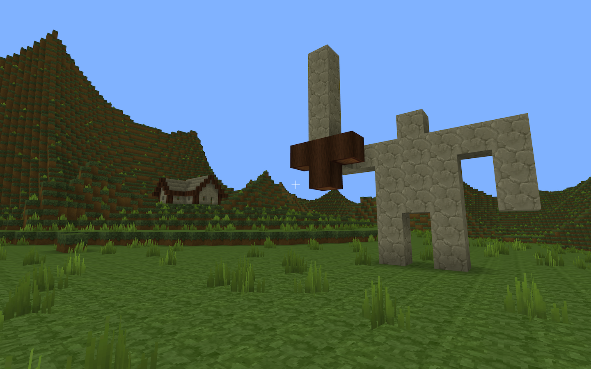
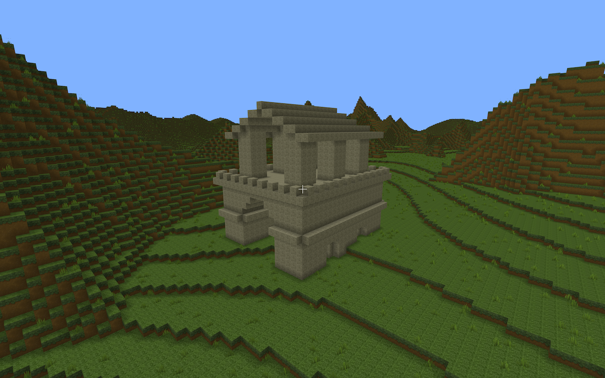

# Voxel Game

A minecraft clone written in Kotlin, a refactor of my old VoxelGame1, which was written in c++.

Uses lwjgl's openGL bindings for a custom game engine. Currently implements procedural generation with 32^3 chunks, placing + breaking blocks with naive raycasting, player movement + physics, and real-time multiplayer with web sockets.

